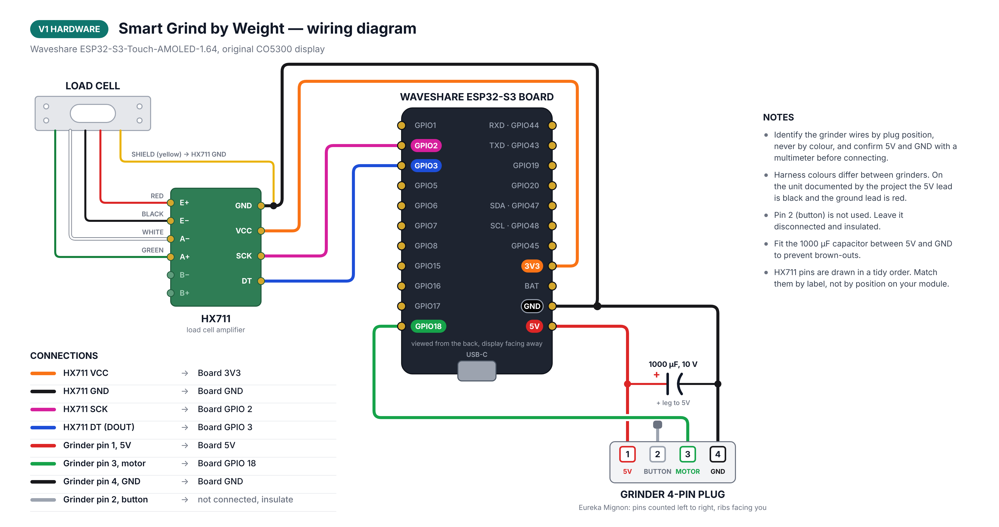
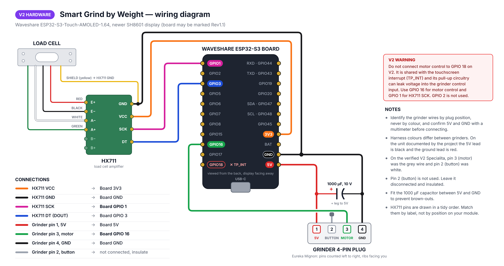

# Hardware and Installation

Use this guide to collect the parts, print the mounts, wire the low-voltage
components and physically install Smart Grind. Start at the
[documentation home](DOC.md) if you have not yet identified the display
generation or confirmed grinder compatibility.

> [!CAUTION]
> Disconnect the grinder from mains before opening it. Preserve protective
> earth and insulation, and use a qualified person for mains work if needed.
> Bench-test the controller, HX711 and load cell using USB power before the
> motor-control lead is connected.

**On this page:** [Parts](#parts-list) · [3D-printed parts](#3d-printed-parts) ·
[Assembly video](#assembly-video) · [Wiring](#installation-and-wiring) ·
[Installation steps](#installation-steps)

## Parts list

> **Note:** All links are **for reference only** — sellers and items are **not personally verified** unless explicitly stated.

- **[Waveshare ESP32-S3 1.64" AMOLED Touch Display](https://www.waveshare.com/esp32-s3-touch-amoled-1.64.htm)** — Main controller. Waveshare has shipped incompatible V1 and V2 display revisions; confirm the revision before flashing.
- **[HX711 ADC module](https://nl.aliexpress.com/item/1005006851380544.html)** — Load cell amplifier
- **MAVIN or T70 load cell** (0.3 – 1 kg range) — Weight sensor
  ⚠️ Avoid cheap unshielded small load cells — accuracy will suffer
  - **Required dimensions:** 70 × 22 × 15 mm (L × H × D)
  - **Screw pattern:** 4 holes in rectangular layout (`: :` pattern), NOT linear (`. . . .`)
  - **1 kg:** Recommended. Suits portafilter use cases.
  - **0.3 kg:** Only suitable for dosing cups.
  - **Examples:**
    - [AliExpress T70](https://nl.aliexpress.com/item/1005009409460619.html)
    - [TinyTronics MAVIN](https://www.tinytronics.nl/en/sensors/weight-pressure-force/load-cells/mavin-load-cell-0.3kg)
    - [NA6 (Mavin) 0.3 / 1 kg](https://www.alibaba.com/product-detail/subject_1601564701384.html) - [NA6 that delivers to Germany](https://de.aliexpress.com/item/1005002600322988.html)
    - [T70 1 kg](https://nl.aliexpress.com/item/1005008658337192.html)
    - [P70 1 kg](https://nl.aliexpress.com/item/1005006257978435.html) (looks compatible with T70, not personally tested)
  - **Tested:** Only the 1 kg T70 and 0.3 kg Mavin load cells have been personally verified
- **6× M3 screws** (≈10 mm) — Mounting hardware
- **1000 µF capacitor** (≥10 V) — Brownout protection. Smaller values may work; larger voltage ratings (e.g. 25V) are fine but physically bigger, so check fitment. [Example (untested)](https://nl.aliexpress.com/item/1005006037906723.html)
- **Wires & Dupont connectors** — General wiring
  Example: [22 AWG silicone wire set](https://www.aliexpress.com/item/2255800441309579.html)
- **Dupont connector kit** — [Example (untested)](https://nl.aliexpress.com/item/1005008995345289.html)
- **Angled pin headers** — [Example (untested)](https://nl.aliexpress.com/item/1005006149080284.html)
- **[JST-PH 4-pin male connector (optional)](https://nl.aliexpress.com/item/1005009479983500.html)** — Optional solder-free connection to Eureka

[](../media/waveshare_board_wired_up_1.jpg)

### 3D Printed Parts

All parts designed to print **without supports**. Keep the orientation of the STL files. Some holes are covered with thin plastic layers that you can easily remove.

**Print Settings:**
- **Material**: PETG (preferred) - Flexible enough for snap fits to work properly
- **Layer Height**: 0.2mm
- **Alternative**: PLA might work but will offer a reduced experience due to brittleness

**Default Eureka Parts** (`3d_files/`):

- **[Screen adapter](../3d_files/Waveshare%20AMOLED%201_64%20adapter.stl)** - Mounts Waveshare screen to Eureka location
- **[Back plate](../3d_files/Back%20plate.stl)** - Mounts to Eureka and holds HX711/load cell
- **[Cover plate](../3d_files/Cover.stl)** - Clean finishing cover
- **Cup holder** - Connects to load cell for dosing cup
  - **[54mm cup holder](../3d_files/54mm%20Cup%20holder.stl)** - For 54mm dosing cups
  - **[58mm cup holder](../3d_files/58mm%20Cup%20holder.stl)** - For 58mm dosing cups
- **Screw hole covers** - Hides screws and protects against coffee grounds
  - **[54mm hole cover](../3d_files/54mm%20Cup%20holder%20hole%20cover.stl)**
  - **[58mm hole cover](../3d_files/58mm%20Cup%20holder%20hole%20cover.stl)**

**Community Designs:**

Looking for grinder-specific mounts or portafilter holders? See **[Community 3D Designs](3D_PRINTS.md)** for portafilter holders, alternative screen mounts, and adaptations for other grinder models.

### Fusion 360 Source Files
- **[All components](https://a360.co/3HYgubb)** - Customizable source files

Use these to adjust mounts for your specific grinder. Cup holders available for 54mm and 58mm dosing cups.
Compatible dosing cup: [AliExpress 54mm Cup](https://nl.aliexpress.com/item/1005006526852408.html)

---

## Assembly video

Watch the complete Eureka Mignon Specialita assembly process: **[YouTube Assembly Guide](https://youtu.be/-kfKjiwJsGM)**

---

## Installation and wiring

**V1 hardware** (original CO5300 display):

[](../media/wiring_diagram_v1.png)

**V2 hardware** (newer SH8601 display, may be marked Rev1.1):

[](../media/wiring_diagram_v2.png)

Both diagrams show 5V in red and ground in black whatever colours your grinder harness uses, and draw the HX711 pins in a tidy order rather than their physical order. Match connections by label and plug position, not by colour or position. Editable sources are in `../media/wiring_diagram_v1.svg` and `../media/wiring_diagram_v2.svg`; the original photo-style diagram is still available as [`wiring_diagram.png`](../media/wiring_diagram.png).

### Pin Configuration

**HX711 Load Cell Amplifier Connections:**
```
ESP32-S3 GPIO 2 (V1) / GPIO 1 (V2) → HX711 SCK
ESP32-S3 GPIO 3    →    HX711 DOUT
ESP32-S3 3.3V      →    HX711 VCC
ESP32-S3 GND       →    HX711 GND
```

**Load Cell to HX711 Wiring:**
```
Load Cell           HX711
Red (E+)         →  E+
Black (E-)       →  E-
White (A-)       →  A-
Green (A+)       →  A+
Yellow (Shield)  →  GND
```

- Connect the load cell shield wire (usually yellow) to the HX711 GND
- The HX711 only has 1 GND pin - solder the shield wire to the backside of the pin header
- **Tip**: Keep the load cell wire as short as possible to reduce noise

### Recommended Wire Lengths

Advised lengths:
- **Load cell → HX711:** ~10 cm
- **Eureka → Waveshare board:** ~15 cm (image shows a slightly shorter lead; 15 cm gives comfortable slack)
- **Grinder harness → HX711:** ~30 cm to route from the housing feed-through to the amplifier without strain

These lengths fit the Eureka Mignon layout shown here; other grinders may require different cable lengths.

[](../media/wiring%20length.jpg)

**Eureka Mignon Connections:**

⚠️ **CRITICAL WARNING:** Always verify your specific Eureka's wiring independently! Wire colors vary between units and cannot be trusted. Use the numbered pin positions shown in the reference image.

Using the 4-pin Eureka plug pinout (see `../media/4-pin_Eureka_plug_pinout.png`), counting from left to right with the plug oriented with 'ribs' towards you:

[](../media/4-pin_Eureka_plug_pinout.png)

```
ESP32-S3 5V        →    Pin 1 (5V power)
                        Pin 2 (Button signal - not used in this project)
ESP32-S3 GPIO 18 (V1) / GPIO 16 (V2) → Pin 3 (Motor control signal)
ESP32-S3 GND       →    Pin 4 (Ground)
```

**4-Pin Eureka Plug Reference (Left to Right):**
- **Pin 1**: 5V power supply
- **Pin 2**: Button signal (unused in this project)
- **Pin 3**: Motor control signal *(active-high — the motor runs when the revision-specific GPIO drives this pin to ~3.3V)*
- **Pin 4**: Ground

> [!WARNING]
> On V2, do not connect motor control to GPIO 18. It is shared with the touchscreen interrupt (`TP_INT`) and its pull-up circuitry can leak voltage into the grinder control input. The physically verified V2 wiring uses GPIO 16 for motor control and GPIO 1 for HX711 SCK.

⚠️ **VERIFY 5V:** Use a multimeter to confirm the 5V pin and identify the motor lead by plug position, not colour. In the verified V2 Specialita installation, Pin 3 (motor control) was the **grey** wire and Pin 2 (unused button signal) was **white**; an earlier assumption had these reversed. Wire colours can differ between grinder revisions, so treat this only as a checked example and leave Pin 2 disconnected and insulated.

### Installation Steps

1. **Flash the firmware** on the Waveshare board using the
   [firmware and first-setup guide](FIRMWARE_SETUP.md)
2. **Add the 1000μF capacitor** between 5V and ground (protects against brownouts)
3. **Create HX711 to Waveshare connection:**
   - Add angled pin headers to HX711 (VCC, GND, DOUT, SCK pins)
   - Connect dupont cables to Waveshare board
   - Load cell can be directly soldered to HX711 (Make the wires as short as possible. Connect shield wire as well to GND)
4. **For Eureka Mignon assembly:**
   - Disassemble top plate and front plate
   - Remove the button: unscrew from front plate, open grinder from below, unplug connector from powerboard, store plug+cable to revert mod later
   - Use JST-PH plug to connect to Waveshare board
   - **WARNING:** Wire colors vary significantly between Eureka units - always verify pin functions with a multimeter before connecting!
   - Mount Waveshare screen using 3D printed adapter where original screen was (the Waveshare screen with adapter replaces the original screen and reuses the original mounting screws)
   - Fish HX711 wire through housing, exit via button hole
   - Mount load cell and HX711 to 3D printed back plate
   - Clip 3D printed back plate onto Eureka Mignon
   - Connect plug to HX711
   - Add 3D printed cover plate and screw down
   - Add 3D printed dosing cup holder on load cell and screw down
   - Hide screws with 3D printed screw covers
5. **Calibrate the load cell** using the
   [firmware and first-setup guide](FIRMWARE_SETUP.md#initial-calibration).

---

**Next:** [Install firmware and calibrate →](FIRMWARE_SETUP.md)
